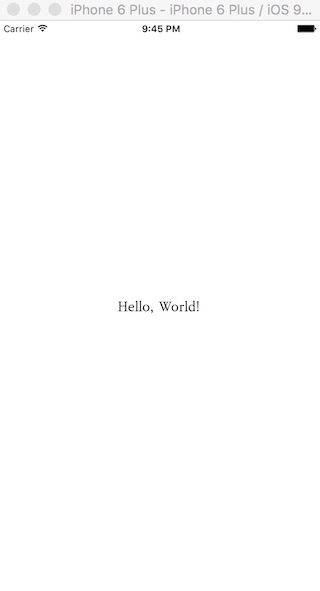
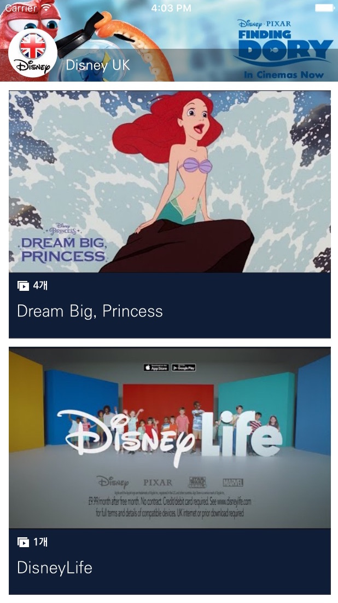

### 시작하기

환영합니다. 이 문서를 통해 여러분은 잼킷을 설치하여 네이티브 앱을 즉시 만들 수 있는 방법을 배울 수 있습니다. 만약 잼킷이 이미 설치되어 있고 잼킷을 이용하여 앱을 생성하는 방법을 알고 있다면 바로 튜토리얼 문서로 건너뛰어도 좋습니다.

### 준비사항

잼킷을 사용하기 위해서는 Mac 운영체제가 설치된 PC가 필요합니다. 아쉽게도 현재로서는 MS윈도우 운영체제를 지원할 계획은 없습니다. Mac 운영체제가 설치된 PC에 Xcode와 node.js, 잼킷 명령어 도구를 설치하면 사전 준비는 완료됩니다. 

우선 [Homebrew](http://brew.sh/index_ko.html)를 이용하여 node.js를 설치합니다.

	brew install node

node가 설치되었다면 npm 명령어를 이용하여 잼킷 명령어 도구를 설치합니다. 

	sudo npm install -g jamcmd

Xcode는 [Mac App Store](https://itunes.apple.com/us/app/xcode/id497799835?mt=12)에서 설치하시기 바랍니다. Xcode가 설치되었다면 아래 명령을 통해 Xcode 명령어 도구를 설치하셔야 합니다.

	xcode-select --install

축하합니다. 이제 잼킷을 사용하여 네이티브 앱을 만들 준비가 완료되었습니다.

### 10초 만에 앱 만들기

잼킷을 사용하여 만들 첫번째 앱은 HelloWorld라는 이름의 앱입니다. 아래 명령을 수행하면 HelloWorld란 디렉토리에 기본 앱이 자동으로 생성됩니다. 이 때 생성된 앱은 잼킷이 기본으로 제공하는 템플릿의 복사본이며, [잼킷 템플릿 저장소](https://github.com/bookjam/jamkit-templates)에서 잼킷이 제공하는 다양한 종류의 템플릿을 확인할 수 있습니다.

	jamkit create HelloWorld

HelloWorld라는 디렉토리가 생성되었다면 해당 디렉토리로 이동하여 앱을 실행할 수 있습니다. 아래 명령을 수행하면 Xcode와 함께 설치된 iOS 시뮬레이터가 자동으로 실행되고 그 안에서 HelloWorld 앱이 실행되는 것을 확인하실 수 있습니다.

	cd HelloWorld
	jamkit run

아래와 같은 화면이 나온다면 첫번째 앱을 성공적으로 실행한 것입니다. 

### 유튜브 채널 앱 만들기

앱을 만드는 방법을 배웠으니 이제 좀더 유용한 앱을 만들어 보겠습니다. 잼킷이 제공하는 템플릿 중 하나인 유튜브 채널 템플릿을 사용한다면 단숨에 멋진 유튜브 채널 앱을 만들 수 있습니다. 준비해야 할 것은 유튜브 채널 아이디 뿐입니다. 

잼킷 명령어에 --template 옵션을 사용하면 특정 템플릿의 복사본을 만들 수 있습니다. 유튜브 채널 앱 제작에 사용할 템플릿은 youtube-channel-basic 입니다. 또한 --language 옵션으로 앱에서 기본적으로 사용할 언어를 지정할 수 있습니다. 이번 유튜브 앱에는 한국어를 사용해보도록 하겠습니다. 한국어는 ko 입니다.

	jamkit create --template=youtube-channel-basic --language=ko YouTubeSample
	cd YouTubeSample
	jamkit run

위의 명령을 수행하면 방금 만든 유튜브 앱이 실행됩니다. 하지만 제대로 된 화면이 나오지 않을 것입니다. 당연하게도 아직 유튜브 채널 아이디를 앱 내에 지정한 적이 없기 때문입니다. 앱 디렉토리 안에서 catalog_home.sbml 파일을 찾아 파일 내의 ${YOUTUBE_CHANNEL_ID}를 실제 유튜브 채널 아이디로 대치해주시기 바랍니다. 예제에서는 왕좌의 게임 공식 채널 아이디인 UCQzdMyuz0Lf4zo4uGcEujFw를 사용하였습니다. 그 뒤 파일을 저장하면 iOS 시뮬레이터의 앱이 변화를 감지하여 새로운 화면으로 업데이트할 것입니다. catalog_home.sbml 파일의 위치는 아래 내용을 참고하시기 바랍니다.

	catalogs/MainApp/catalog_home.sbml

아래와 같은 화면이 나왔다면 유튜브 채널 앱을 성공적으로 만든 것입니다.

### 카카오톡으로 앱 전달하기

앱을 시뮬레이터에서만 사용하려고 만드는 사람은 없을 것입니다. 잼킷으로 만든 앱은 카카오톡이나 메일, 웹 링크 등으로 친구들에게 전달할 수 있습니다. 이렇게 앱을 전달하기 위해서는 먼저 jam 파일을 만들어야 합니다. jam 파일이란 잼킷으로 제작한 앱을 하나의 파일로 묶은 잼킷 패키지를 말합니다. jam 파일을 만들기 위해서는 build 명령어를 사용합니다. 앱 디렉토리 안에서 아래 명령을 수행하면 해당 디렉토리 안에 {프로젝트명}.jam 이라는 파일이 생성됩니다.

	jamkit build

이렇게 생성된 jam 파일을 카카오톡이나 메일로 친구들에게 전달하면 클릭 한번으로 바로 앱을 사용할 수 있습니다. 물론 jam 파일을 전달받은 친구의 스마트폰에 잼킷 브라우저 기능이 탑재된 앱이 설치되어 있어야 합니다. (잼킷 브라우저 기능을 탑재한 Slidly 앱이 2016년 8월 중 런칭 예정입니다.)

### 앱 배포하기

잼킷으로 만든 앱은 애플 앱스토어와 구글 플레이 등의 안드로이드 마켓으로도 배포할 수 있습니다. 앱을 배포하는 데 드는 비용은 무료입니다. 무료 앱에는 광고가 게재될 수 있으며, 광고를 제거한 월 과금 방식의 유료 버전으로 배포할 수도 있습니다. (2016년 7월 20일 현재, 앱 배포 기능은 개발 진행 중에 있습니다. 그 전에 배포가 필요하다면 help@bookjam.co.kr로 연락주시기 바랍니다.)

### 더 알아보기

잼킷에 관심이 생기셨나요? 그렇다면 [한국 잼킷 사용자 모임](https://www.facebook.com/groups/1736390759957055)을 방문해보세요. 앞으로 잼킷과 관련된 새로운 소식이나 사용법 강좌 등이 잼킷 사용자 모임을 통해 공개될 예정입니다. 

