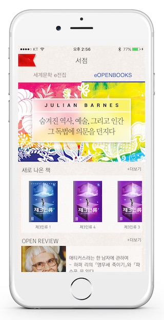
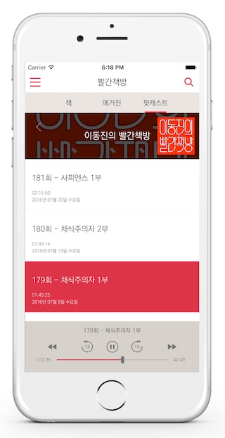
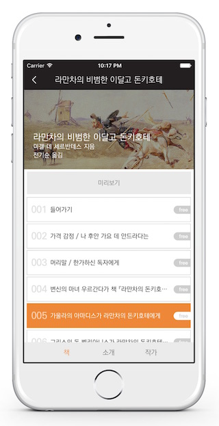
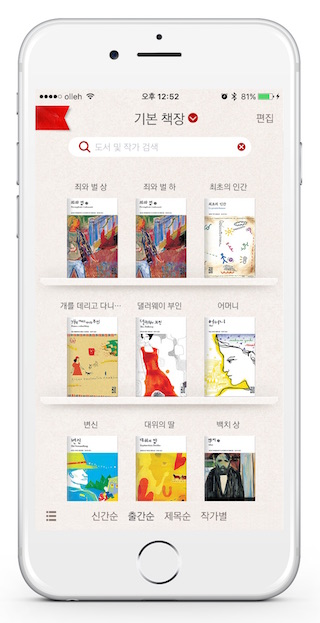

### 잼킷은 네이티브 앱 제작 툴입니다.

잼킷은 모바일 네이티브 앱을 쉽고 빠르게 만들 수 있는 툴입니다. 어려운 개발 언어를 사용할 필요가 없이 단순한 마크업 언어만으로 네이티브 앱을 만들 수 있기 때문에 초보 개발자나 비개발자들도 어렵지 않게 사용할 수 있는 툴입니다. 그렇지만 기능이 부족할 것이라 염려할 필요는 없습니다. 잼킷이 기본적으로 제공하는 다양한 모듈을 조합하면 상용으로도 손색이 없는 고품질 앱을 뚝딱 만들어낼 수 있습니다. 북잼이 제작한 다양한 유료 앱은 모두 잼킷으로 제작되었습니다.

     

### 하이브리드 앱이 아닙니다.

잼킷은 폰갭과 같은 하이브리드 방식의 앱이 아닙니다. 잼킷이 생성하는 앱은 100% 네이티브 앱입니다. 잼킷에서는 유저 인터페이스를 표현하기 위해 웹뷰나 HTML/CSS를 전혀 사용하지 않으며, 오로지 순수 네이티브 뷰와 기능만을 이용하기 때문에 유려한 사용경험을 요구하는 사용자들을 만족시킬 것입니다.

### 크로스 플랫폼은 기본입니다.

잼킷으로 만든 앱은 다양한 플랫폼 위에서 동작합니다. 현재 iOS와 안드로이드를 지원하고 있으며, 웹을 비롯하여 MS윈도우와 Mac 등의 플랫폼을 지원하기 위한 개발이 진행되고 있습니다. 잼킷을 사용하면 각 플랫폼 별로 앱을 따로 만들지 않아도 됩니다. 잼킷으로 한번 제작된 앱은 추가 변경없이 각 플랫폼에 맞춰 동일한 모습으로 실행이 됩니다. 

### 다양한 모듈을 지원합니다.

잼킷에는 북잼이 지난 5년동안 개발한 다양한 모듈이 탑재되어 있습니다. 이 모듈들은 마크업 언어를 통해 쉽게 사용할 수 있으며, 일관된 체계 하에 설계되어 있기 때문에 별다른 교육 없이 참고문서 만으로도 바로 사용할 수 있습니다. 잼킷의 모듈은 계속 개발되고 있으며, 앞으로 버전이 올라갈 때마다 더욱 강력한 기능의 모듈이 추가될 예정입니다. 현재 잼킷에서 제공하는 주요 모듈은 아래 내용을 참고하세요.

* 레이아웃 모듈: 배너(캐러셀), 탭, 무한 스크롤, 좌우 슬라이더 등
* 네비게이션 모듈: 상세 페이지, 팝업, 가이드 등
* 비즈니스 모듈: 다양한 결제 수단(인앱결제, 직접결제, 외부 포인트), 소장/대여제, 멤버십, 프로모션, 쿠폰, 선물 기능 등
* 기능성 모듈: 차트, 캘린더, 퀴즈, 멀티미디어, 음반, 독서통계 등

### 고품질 콘텐츠 뷰어를 탑재했습니다.

잼킷에는 고품질 콘텐츠 뷰어가 탑재되어 있으므로, 전자책이나 만화, 웹툰, 동영상, 오디오 등의 콘텐츠를 바로 서비스할 수 있습니다. 지원하는 전자책 포맷으로는 BXP와 PDF가 있으며, ePub은 BXP 자동 변환 도구를 이용하여 바로 서비스가 가능합니다.

BXP는 북잼이 자체 개발한 고품질 전자책 포맷입니다. BXP는 기존 전자책 포맷에 비해 뛰어난 레이아웃의 구현이 가능합니다. 또한 동영상/오디오 등의 멀티미디어는 기본적으로 지원하며, 시험이나 문제풀이, 녹음 등의 스마트 교육에 필요한 기능도 다양하게 지원하고 있습니다. 아래 영상에서 BXP 포맷의 놀라운 기능을 확인해보세요.

<iframe width="560" height="315" src="https://www.youtube.com/embed/IWicDAojd70?list=PL_7HjgpQk886_-fAhfhatO6Upfsr2z3n8" frameborder="0" allowfullscreen></iframe>

### 지금 바로 시작하세요!

10분만 투자하면 지금 당장 앱을 만들어 볼 수 있습니다. 지금 바로 [시작해보세요](start.md). 잼킷에 대한 자세한 설명을 원하신다면 [한국 잼킷 사용자 모임](https://www.facebook.com/groups/1736390759957055)을 방문해보세요.
