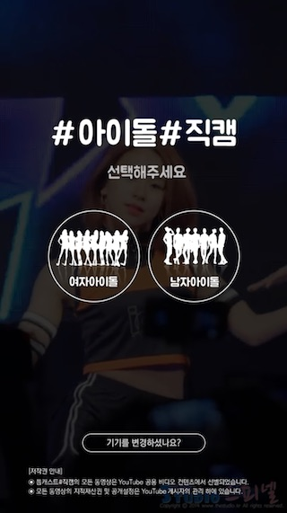
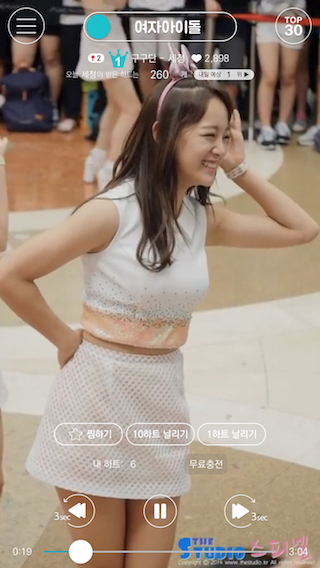

## 샘플 사용법

### 준비사항

잼킷을 설치하셨나요? 만약 설치하지 않았다면 [시작하기](start.md)부터 따라해보세요. 잼킷을 설치하신 분들도 아래 명령을 수행하여 가장 최신의 잼킷 버전으로 업데이트 해주세요.

	sudo npm install -g jamcmd 

만약 Xcode 시뮬레이터에 이미 잼킷이 설치되어 있다면 최신 잼킷이 제대로 적용되지 않을 수 있습니다. 이 때는 시뮬레이터를 리셋하거나 설치된 잼킷 앱을 지워주셔야 합니다.

### 샘플 실행하기

아래에 공개되어 있는 샘플 중에 하나를 다운로드 해주세요. 샘플 파일의 확장자는 zip입니다. 다운로드한 잼킷 샘플 파일을 원하는 디렉토리로 옮겨 압축을 해제합니다. 압축이 해제된 해당 디렉토리로 이동하여 아래와 같은 명령을 수행하면 샘플 앱이 실행됩니다. 

	jamkit run

## 튭캐스트#직캠

유튜브에 올라와있는 걸그룹/보이그룹의 개인별 직캠 영상을 모아놓은 앱. 직캠의 특성인 세로 영상을 감상하기 좋은 직관적인 인터페이스를 적용하였다. 또한 자신이 좋아하는 아이돌에게 하트를 날리고, 하트 수에 따라서 아이돌의 순위가 결정되는 기능을 포함시켜 영상을 보는 재미를 배가하였다.

- 잼킷 파일 다운로드: [TuubcastFancam.zip](samples/TuubcastFancam.zip) 
- 앱스토어 바로가기: [http://apple.co/2iejnpG](http://apple.co/2iejnpG)
- 구글플레이 바로가기: [http://bit.ly/2hSOK68](http://bit.ly/2hSOK68)

 