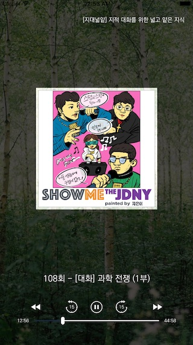
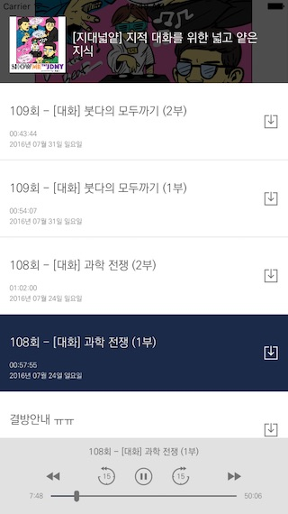

## 팟캐스트 템플릿

### (1) 팟캐스트 베이직(podcast-basic)

팟캐스트 URL을 이용하여 메인 페이지와 피드 목록을 서비스하는 앱

 

#### 사용법

	jamkit create --template=podcast-basic --language=ko {프로젝트 이름}

#### 지원언어

한국어(ko)

#### 템플릿 수정사항

${PODCAST_URL}: 팟캐스트의 URL (필수)

	catalogs/MainApp/P_PODCAST_LIST_pane.sbml
	catalogs/MainApp/P_PODCAST_RECENT_pane.sbml

background_image_0001.jpg: 메인 화면 배경으로 사용될 이미지 (선택)

	catalogs/MainApp/Images/background_image_0001.jpg
