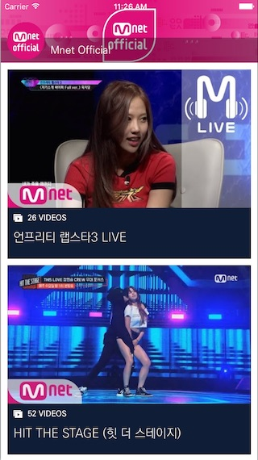
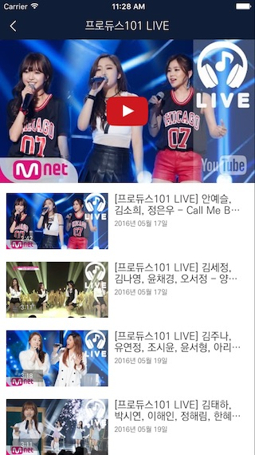
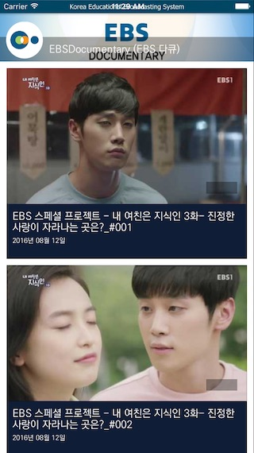
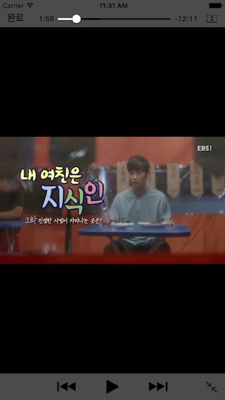
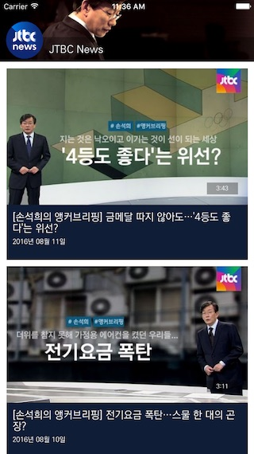

## 유튜브 채널 베이직

유튜브 채널 내의 재생목록별 비디오를 서비스하는 앱

 

### 명령어

	jamkit create --template=youtube-channel-basic --language=ko {프로젝트 이름}

### 지원언어

한국어(ko)

### 템플릿 사용자 정의

- ${YOUTUBE_CHANNEL_ID}: 유튜브 채널의 ID (필수)

```
catalogs/MainApp/catalog_home.sbml
```

- $THEME_COLOR_00, $THEME_COLOR_01: 메인 색상 (선택)

```
catalogs/MainApp/themes.sbss
```

## 유튜브 채널 비디오

유튜브 채널 내의 모든 비디오를 하나의 목록으로 서비스하는 앱

 

### 명령어

	jamkit create --template=youtube-channel-videos --language=ko {프로젝트 이름}

### 지원언어

한국어(ko)

### 템플릿 사용자 정의

- ${YOUTUBE_CHANNEL_ID}: 유튜브 채널의 ID (필수)

```
catalogs/MainApp/catalog_home.sbml
```

- $THEME_COLOR_00, $THEME_COLOR_01: 메인 색상 (선택)

```
catalogs/MainApp/themes.sbss
```

## 유튜브 재생목록 베이직

유튜브 재생목록 내의 비디오를 서비스하는 앱

 

### 명령어

	jamkit create --template=youtube-playlist-basic --language=ko {프로젝트 이름}

### 지원언어

한국어(ko)

### 템플릿 사용자 정의

- ${YOUTUBE_PLAYLIST_ID}: 유튜브 재생목록의 ID (필수)

```
catalogs/MainApp/catalog_home.sbml
```

- ${YOUTUBE_CHANNEL_ID}: 유튜브 채널의 ID (필수)

```
catalogs/MainApp/showcase_videos_toolbar.sbml
```

- $THEME_COLOR_00, $THEME_COLOR_01: 메인 색상 (선택)

```
catalogs/MainApp/themes.sbss
```
